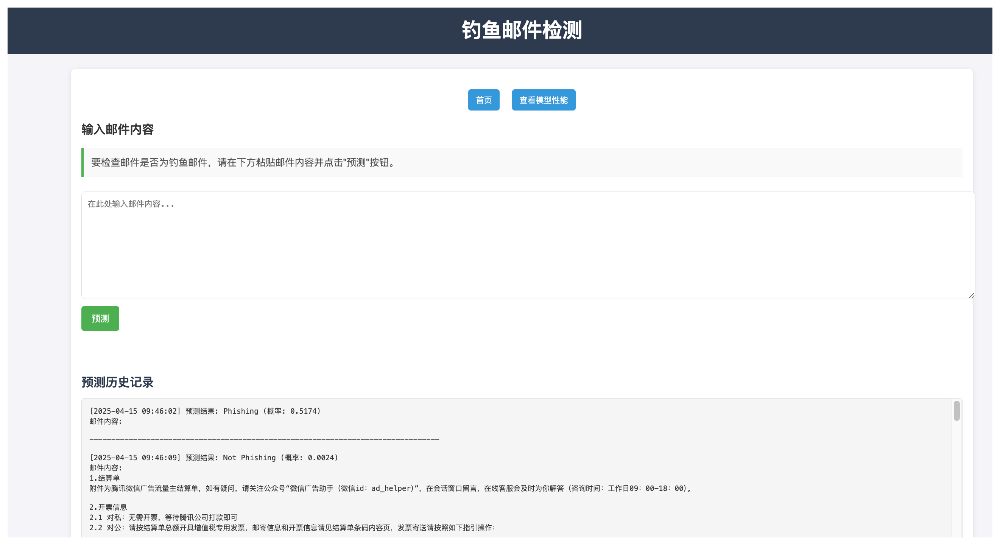
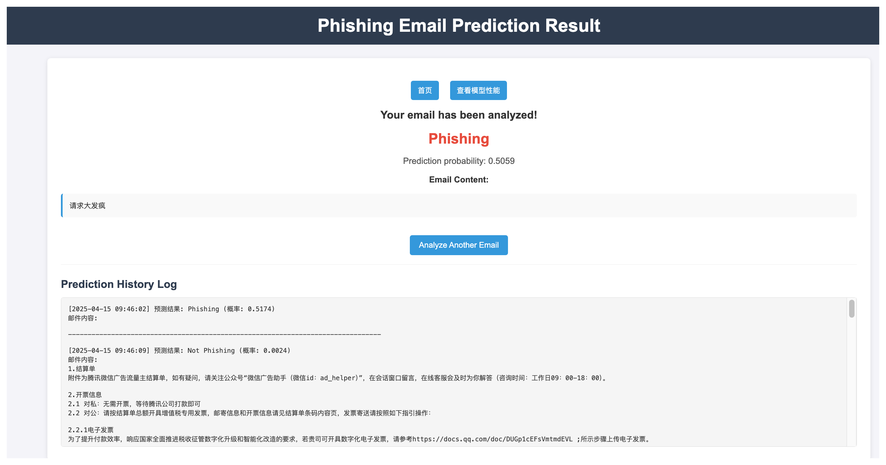
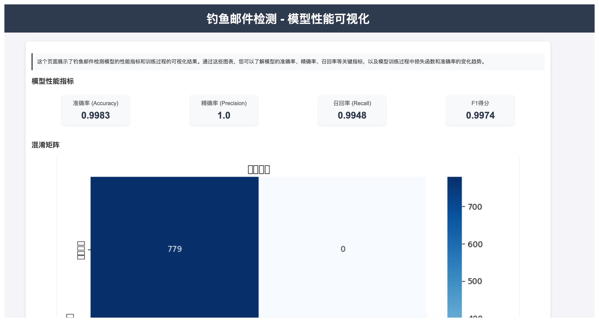
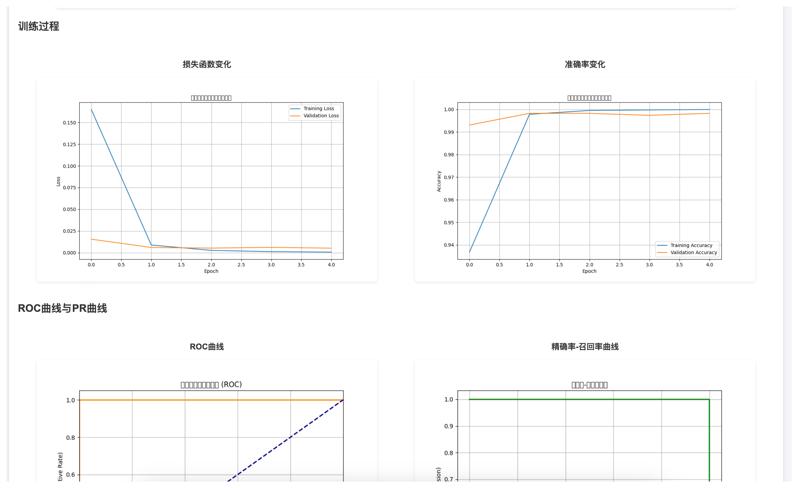
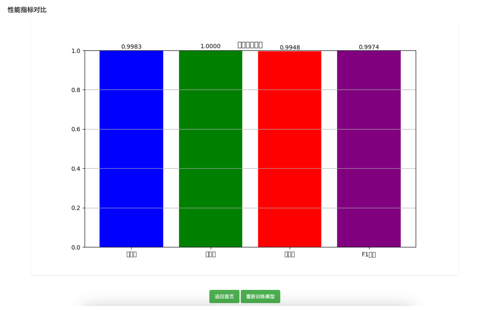

# phishingDP

## 介绍
**phishingDP** 是一个基于机器学习的网络钓鱼邮件智能检测与防护系统，旨在通过深度学习技术识别潜在的钓鱼邮件，保护用户免受网络诈骗威胁。该系统集成了数据预处理、模型训练、实时预测和结果可视化功能，提供用户友好的Web界面，支持邮件内容输入、预测结果展示以及模型性能分析。

**核心功能：**  
- 检测输入邮件是否为钓鱼邮件（二分类：正常/钓鱼）。  
- 提供详细的模型性能可视化，包括训练曲线、混淆矩阵、ROC曲线等。  
- 支持模型重新训练，适应新数据或优化性能。  
- 记录预测历史，便于追踪和分析。  

**实现思路：**  
1. **数据获取**：使用`spam_assassin.csv`数据集，包含邮件内容和标签（0=正常，1=钓鱼）。  
2. **数据预处理**：通过NLTK分词和Scikit-learn的TF-IDF向量化，将邮件文本转换为特征向量。  
3. **模型构建**：基于Keras的Sequential神经网络，包含多层Dense和Dropout，用于二分类任务。  
4. **模型训练与保存**：训练模型并保存为HDF5格式，支持重复加载和预测。  
5. **实时预测**：通过Flask Web界面接收用户输入的邮件内容，调用模型进行预测。  
6. **结果展示**：展示预测结果（钓鱼/正常）及概率，同时记录预测日志。  
7. **性能可视化**：生成训练历史、混淆矩阵、ROC曲线、PR曲线和性能指标图，保存在`static`目录。

## 软件架构
系统采用模块化设计，结合Python生态中的多种工具，架构清晰且易于扩展：  
- **前端**：  
  - 使用Flask的Jinja2模板引擎，渲染HTML页面。  
  - 提供主页（邮件输入）、结果页（预测结果与日志）和可视化页（模型性能图表）。  
  - 支持动态更新日志内容，增强交互性。  
- **后端**：  
  - Flask框架处理路由（`/`、`/predict`、`/visualize`、`/retrain`）和请求。  
  - 集成Keras模型，执行实时预测。  
  - 日志系统将预测结果和邮件内容保存至`prediction_results.log`。  
- **数据处理**：  
  - **NLTK**：用于邮件文本分词，生成词序列。  
  - **Scikit-learn**：使用`TfidfVectorizer`将文本转换为TF-IDF特征向量（最大5000维）。  
  - 数据集分割为80%训练集和20%测试集，确保模型评估的可靠性。  
- **模型**：  
  - Keras Sequential模型，结构为：  
    - 输入层：接受TF-IDF特征（5000维）。  
    - 隐藏层1：128个神经元，ReLU激活，Dropout(0.2)防止过拟合。  
    - 隐藏层2：64个神经元，ReLU激活。  
    - 输出层：1个神经元，Sigmoid激活，输出钓鱼概率。  
  - 优化器：Adam；损失函数：二元交叉熵；评估指标：准确率。  
  - 训练参数：5个epoch，批次大小32。  
  - 模型保存为`phishing_model.h5`，便于重复使用。  
- **可视化**：  
  - 使用Matplotlib和Seaborn生成以下图表，存储在`static`目录：  
    - 训练/验证损失和准确率曲线（`loss_curve.png`, `accuracy_curve.png`）。  
    - 混淆矩阵热图（`confusion_matrix.png`）。  
    - ROC曲线（含AUC，`roc_curve.png`）。  
    - 精确率-召回率曲线（`pr_curve.png`）。  
    - 性能指标条形图（准确率、精确率、召回率、F1得分，`metrics_bar.png`）。  
  - 数据文件（如`training_history.csv`, `confusion_matrix.npy`）支持图表重现。  
- **日志**：  
  - 预测结果以时间戳、结果（钓鱼/正常）、概率和邮件内容的格式记录。  
  - 日志文件动态加载到前端，方便用户查看历史记录。
 

## 安装教程

1. **克隆仓库**  
   ```bash
   git clone https://github.com/yourusername/phishingDP.git
   cd phishingDP

2. **安装依赖**
确保已安装Python 3.8+，然后安装所需库：
    ```python
    pip install -r requirements.txt
  
1. **下载NLTK数据**
运行以下命令下载NLTK分词器所需数据：
    ```python
    python -m nltk.downloader punkt
4. **准备数据集**
将spam_assassin.csv数据集放置在项目根目录下。如果没有数据集，可从公开数据集（如SpamAssassin）下载并转换为CSV格式。
## 使用说明
**启动应用**   
在项目根目录下运行：python app.py   
默认在http://0.0.0.0:5003启动服务。
     
**访问页面**   
- 打开浏览器，访问http://localhost:5003/。   
- 在主页输入邮件内容，点击提交以预测是否为钓鱼邮件。   
- 查看预测结果和历史记录（日志）。
     
**查看可视化**   
访问http://localhost:5003/visualize查看模型性能图表，包括：
- 训练过程中的损失和准确率曲线
- 混淆矩阵
- ROC曲线
- 精确率-召回率曲线
- 性能指标条形图（准确率、精确率、召回率、F1得分）
- 重新训练模型
- 通过http://localhost:5003/retrain（POST请求）触发模型重新训练。
- 或者删除phishing_model.h5文件后重启应用，系统会自动重新训练。
    
   
   
## 参与贡献
- Fork 本仓库    
- 新建 Feat_xxx 分支   
- 提交代码   
- 新建 Pull Request   
## 特技
- 高性能模型：使用TF-IDF特征化和Keras神经网络，实现高效的钓鱼邮件检测。   
- 丰富可视化：提供多维度评估图表（混淆矩阵、ROC曲线等），便于分析模型性能。   
- 用户友好：简洁的Web界面，支持实时预测和历史记录查看。   
- 可扩展性：支持模型重新训练，易于集成新数据集或优化算法。   